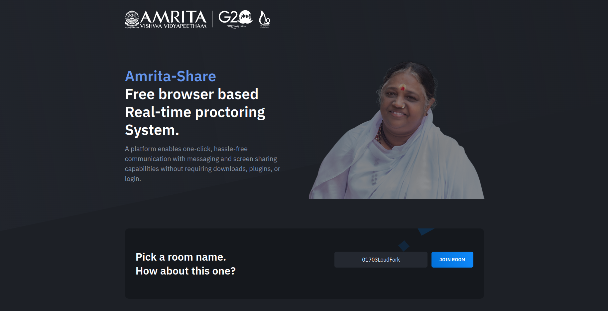

# `<p align="center">`Amrita-Share `</p>`

<p align="center">Free WebRTC - SFU - Simple, Secure, Scalable Real-Time Video Conferences Up to 4k, compatible with all browsers and platforms.</p>

<hr />

<p align="center">
  
</p>

<hr />

<p align="center">
    <a href="">
        
    </a>
</p>

<hr />

<details>
<summary>Features</summary>

<br/>

- Is `100% Free` - `Open Source` - `Self Hosted` and [PWA](https://en.wikipedia.org/wiki/Progressive_web_application)!
- No download, plug-in or login required, entirely browser-based.
- Unlimited number of conference rooms, without call time limitation.
- Desktop and Mobile compatible.
- Optimized Room URL Sharing for mobile.
- Possibility to Password protect the Room for the meeting.
- Lobby mode lets you protect your meeting by only allowing people to enter after a formal approval by a moderator.
- Webcam Streaming up to 4K quality (Front - Rear for mobile).
- Echo cancellation and noise suppression that makes your audio crystal clear.
- Screen Sharing to present documents, slides, and more ...
- File Sharing (with drag-and-drop), share any files to your participants in the room
- Take a snapshot from the video frame(screen/cam) to save it as an image on your device.
- Chat with Emoji Picker to show you feeling, private messages, Markdown support, possibility to Save the conversations, and many more.
- Speech recognition, execute the app features simply with your voice.
- Advance collaborative whiteboard for the teachers.
- Select Microphone - Speaker and Video source.
- Recording your Screen, Audio, or Video.
- Share any YouTube video in real-time to your participants.
- Share any mp4, webm, ogg video in real-time to your participants with possibility to download it.
- Full-Screen Mode on mouse click on the Video element, Zoom In/Out on video mouse wheel.
- Possibility to Change UI Themes.
- Possibility to protect your Host with username and password (default disabled).
- Supports [REST API](app/api/README.md) (Application Programming Interface).
- [Slack](https://api.slack.com/apps/) API integration.
- [Sentry](https://sentry.io/) error reporting.

</details>

<details>
<summary>About</summary>

- [Presentation](https://www.canva.com/design/DAE693uLOIU/view)
- [Video](https://www.youtube.com/watch?v=_IVn2aINYww)

</details>

<details>
<summary>Direct Join</summary>

<br/>

  | Params   | Type           | Description     |
  | -------- | -------------- | --------------- |
  | room     | string         | room Id         |
  | password | string/boolean | room password   |
  | name     | string         | user name       |
  | audio    | boolean        | audio stream    |
  | video    | boolean        | video stream    |
  | screen   | boolean        | screen stream   |
  | notify   | boolean        | welcome message |

</details>

<details>
<summary>Embed a meeting</summary>

<br/>

Embedding a meeting into a service or app using an iframe.

```html
<iframe
    allow="camera; microphone; display-capture; fullscreen; clipboard-read; clipboard-write; autoplay"
    src="https://sfu.mirotalk.com/newroom"
    style="height: 100%; width: 100%; border: 0px;"
></iframe>
```

</details>

<details open>
<summary>Quick Start</summary>

<br/>

- You will need to have `NodeJS` and all [requirements](https://mediasoup.org/documentation/v3/mediasoup/installation/#requirements) installed, this project has been tested with Node version [16.X](https://nodejs.org/en/blog/release/v18.15.0/).
- Requirements install example for `Ubuntu 22.04`

```bash
# Gcc g++ make
$ apt-get update
$ apt-get install -y build-essential
# Python 3.10 and pip
$ DEBIAN_FRONTEND=noninteractive apt-get install -y tzdata
$ apt install -y software-properties-common
$ add-apt-repository ppa:deadsnakes/ppa
$ apt update
$ apt install -y python3.10 python3-pip
# NodeJS 18.X and npm
$ apt install -y curl dirmngr apt-transport-https lsb-release ca-certificates
$ curl -sL https://deb.nodesource.com/setup_18.x | bash -
$ apt-get install -y nodejs
$ npm install -g npm@latest
```

<summary>Quick start</summary>

<br/>

-   You will need to have `Node.js` installed, this project has been tested with Node versions [12.X](https://nodejs.org/en/blog/release/v12.22.1/), [14.X](https://nodejs.org/en/blog/release/v14.17.5/), [16.X](https://nodejs.org/en/blog/release/v16.15.0/) and [18.X](https://nodejs.org/en/blog/release/v18.15.0/)

```bash
# clone this repo
$ https://github.com/gsabarinath02/ICTS-Amrita-Proctoring_System.git
# go to ICTS-Amrita-Proctoring_System dir
$ cd ICTS-Amrita-Proctoring_System
# copy .env.template to .env (edit it according to your needs)
$ cp .env.template .env
# install dependencies
$ npm install
# start the server
$ npm start
```

-   Open http://localhost:3000 in browser

</details>

